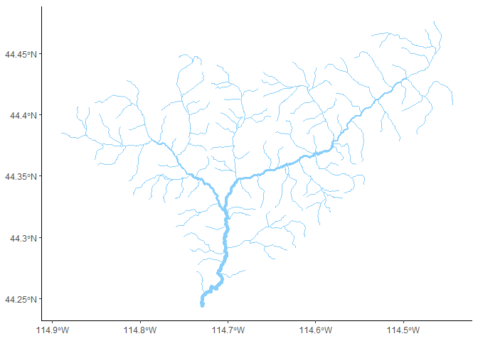
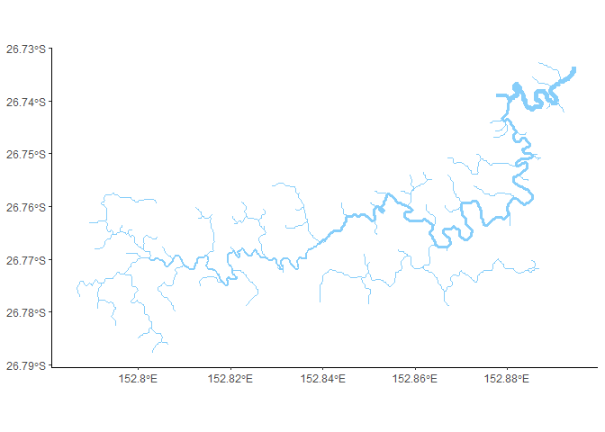

Stream Visualisation
================
Grace Heron
29/07/2020

Reference for some nice streams (subjective). Everything works for
R4.0.2 and proj6. Important packages:

``` r
library(rgdal)
library(raster)
library(tidyverse)
library(ggspatial)
library(ggrepel)
library(SSN)
```

## Yankee-Fork Streams

Yankee-Fork, USA streams with sites, prediction sites and watershed
layers.

``` r
sites <- readOGR("gisdata/yankeefork","sites")
```

    ## OGR data source with driver: ESRI Shapefile 
    ## Source: "C:\spmodels\streamviz\gisdata\yankeefork", layer: "sites"
    ## with 208 features
    ## It has 10 fields
    ## Integer64 fields read as strings:  VisitID VisitYr

``` r
preds <- readOGR("gisdata/yankeefork", "preds")
```

    ## OGR data source with driver: ESRI Shapefile 
    ## Source: "C:\spmodels\streamviz\gisdata\yankeefork", layer: "preds"
    ## with 276 features
    ## It has 29 fields
    ## Integer64 fields read as strings:  COMID FCODE DUP_COMID StreamOrde NEAR_FID

``` r
watershed <- readOGR("gisdata/yankeefork/watershed.shp", "watershed")
```

    ## OGR data source with driver: ESRI Shapefile 
    ## Source: "C:\spmodels\streamviz\gisdata\yankeefork\watershed.shp", layer: "watershed"
    ## with 1 features
    ## It has 17 fields
    ## Integer64 fields read as strings:  OBJECTID_1 OBJECTID_2

``` r
streams <- readOGR("gisdata/yankeefork","streams")
```

    ## OGR data source with driver: ESRI Shapefile 
    ## Source: "C:\spmodels\streamviz\gisdata\yankeefork", layer: "streams"
    ## with 276 features
    ## It has 32 fields
    ## Integer64 fields read as strings:  COMID FCODE DUP_COMID StreamOrde reachID rid netID

### Simple Stream Network

Stream network where the width is proportional to some downstream
accumulative value.

``` r
ggplot() +
  layer_spatial(streams, 
                aes(size = afvArea), 
                colour = "lightskyblue") +
  coord_sf() + 
  scale_size(range = c(0, 2), guide = FALSE) +
  theme_classic()
```

<!-- -->

### Watershed study area with observation sites

Getting slightly fancy. Now add in a watershed and observation sites.
Also an annotation arrow for flavour.

``` r
ggplot() +
  layer_spatial(watershed, fill = "gray60", alpha = 0.5, colour = "gray40") +
  layer_spatial(streams, aes(size = afvArea), colour = "gray50") +
  layer_spatial(sites, colour = "coral", pch = 1, cex = 2, show.legend = TRUE)+
  coord_sf() + 
  labs(x = "Longitude", y = "Latitude") + 
  annotation_north_arrow(height = unit(0.3, "in"),
                         width = unit(0.3, "in"), # GRID NORTH? OR TRUE NORTH?
                         which_north = "grid", 
                         location = "bl") +
  scale_size(range = c(0, 2), guide = FALSE) +
  scale_shape_manual(values=c(25, 24)) + 
  theme_bw() + 
  theme(legend.title = element_blank(),
        axis.title.y=element_blank(),
        axis.title.x=element_blank(),
        axis.text.y = element_text())
```

<!-- -->

## Maleny Streams
