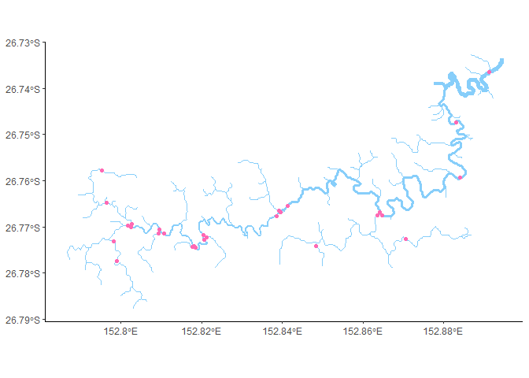
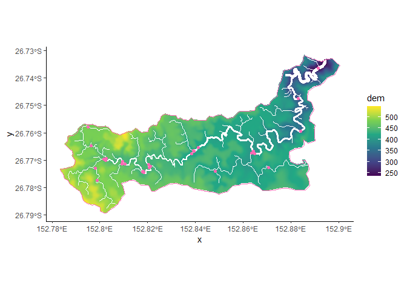
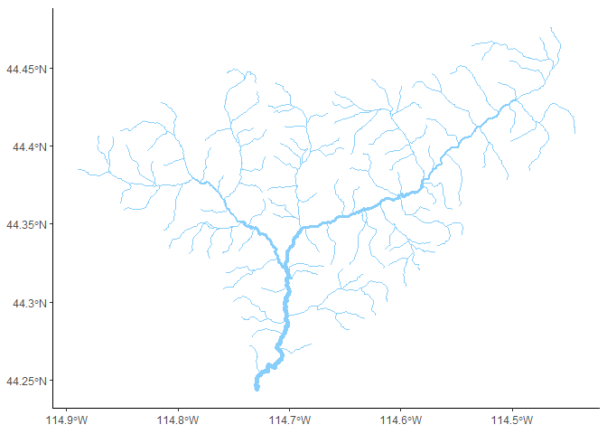
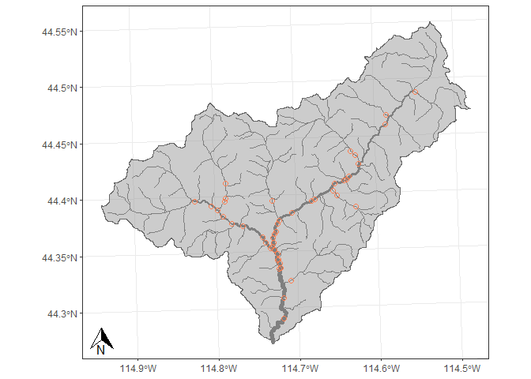

Stream Visualisation
================
Grace Heron
29/07/2020

Reference for some nice streams (subjective) using ggplot2. Everything
works for R4.0.2 and proj6. Important packages:

``` r
library(rgdal) # For shapefiles etc
library(tidyverse) # For ggplot2 and other pkgs
library(ggspatial) # For spatial plotting
library(raster) # For raster handling
```

## Maleny Streams

Maleny’s Obi-Obi Creek, Australia streams with observation sites.

``` r
sites <- readOGR("gisdata/maleny","sites")
```

    ## Warning in OGRSpatialRef(dsn, layer, morphFromESRI = morphFromESRI, dumpSRS =
    ## dumpSRS, : Discarded datum Geocentric_Datum_of_Australia_1994 in CRS definition:
    ## +proj=aea +lat_0=0 +lon_0=153 +lat_1=-20 +lat_2=-40 +x_0=0 +y_0=0 +ellps=GRS80
    ## +units=m +no_defs

    ## OGR data source with driver: ESRI Shapefile 
    ## Source: "C:\spmodels\streamviz\gisdata\maleny", layer: "sites"
    ## with 28 features
    ## It has 5 fields

``` r
streams <- readOGR("gisdata/maleny","streams")
```

    ## Warning in OGRSpatialRef(dsn, layer, morphFromESRI = morphFromESRI, dumpSRS =
    ## dumpSRS, : Discarded datum Geocentric_Datum_of_Australia_1994 in CRS definition:
    ## +proj=aea +lat_0=0 +lon_0=153 +lat_1=-20 +lat_2=-40 +x_0=0 +y_0=0 +ellps=GRS80
    ## +units=m +no_defs

    ## OGR data source with driver: ESRI Shapefile 
    ## Source: "C:\spmodels\streamviz\gisdata\maleny", layer: "streams"
    ## with 150 features
    ## It has 40 fields
    ## Integer64 fields read as strings:  HydroID AHGFFType AusHydroID AusHydroEr SegmentNo DrainID From_Node To_Node NextDownID Enabled FlowDir SrcType SourceID PlanAcc Symbol ConCatID StrOutlet rid netID

``` r
catchment <- readOGR("gisdata/maleny","catchment")
```

    ## Warning in OGRSpatialRef(dsn, layer, morphFromESRI = morphFromESRI, dumpSRS =
    ## dumpSRS, : Discarded datum Geocentric_Datum_of_Australia_1994 in CRS definition:
    ## +proj=aea +lat_0=0 +lon_0=146 +lat_1=-13.1666666666667 +lat_2=-25.8333333333333
    ## +x_0=0 +y_0=0 +ellps=GRS80 +units=m +no_defs

    ## OGR data source with driver: ESRI Shapefile 
    ## Source: "C:\spmodels\streamviz\gisdata\maleny", layer: "catchment"
    ## with 1 features
    ## It has 2 fields
    ## Integer64 fields read as strings:  Id gridcode

``` r
dem <- raster("gisdata/maleny/dem.tif")
```

    ## Warning in showSRID(uprojargs, format = "PROJ", multiline = "NO"): Discarded
    ## datum Unknown based on GRS80 ellipsoid in CRS definition

### Doing the most with the least

Stream network where the width is proportional to some downstream
accumulative value.

``` r
ggplot() +
  layer_spatial(streams, 
                aes(size = AreaAFV), 
                colour = "lightskyblue") +
  coord_sf() + 
  scale_size(range = c(0, 2), guide = FALSE) +
  theme_classic()
```

<!-- -->

### Streams with sites

Add some observation sites. I am a “hotpink” stan (don’t come for me).

``` r
ggplot() +
  layer_spatial(streams, 
                aes(size = AreaAFV), 
                colour = "lightskyblue") +
  layer_spatial(sites, colour = "hotpink")+
  coord_sf() + 
  scale_size(range = c(0, 2), guide = FALSE) +
  theme_classic()
```

<!-- -->

### Other spatial layers

Digital elevation models (dem.tif) layer.

``` r
ggplot() +
  geom_tile(data = as.data.frame(rasterToPoints(dem)), 
            aes(x=x,y=y,fill=dem)) +
  layer_spatial(streams, 
                aes(size = AreaAFV), 
                colour = "white") +
  scale_fill_viridis_c() +
  coord_sf() + 
  scale_size(range = c(0, 2), guide = FALSE) +
  theme_classic()
```

<!-- -->

Catchments/watersheds (catchment.shp). We love ugly colour palettes.

``` r
ggplot() +
   geom_tile(data = as.data.frame(rasterToPoints(dem)), 
            aes(x=x,y=y,fill=dem)) +
  layer_spatial(streams, 
                aes(size = AreaAFV), 
                colour = "white") +
  layer_spatial(catchment, fill = NA, colour = "hotpink") +
  layer_spatial(sites, colour = "hotpink")+
  coord_sf() + 
  scale_size(range = c(0, 2), guide = FALSE) +
  scale_fill_viridis_c() +
  theme_classic()
```

<!-- -->

## Yankee-Fork Streams

Yankee-Fork, USA streams with sites, prediction sites and watershed
layers.

``` r
sites <- readOGR("gisdata/yankeefork","sites")
```

    ## OGR data source with driver: ESRI Shapefile 
    ## Source: "C:\spmodels\streamviz\gisdata\yankeefork", layer: "sites"
    ## with 208 features
    ## It has 10 fields
    ## Integer64 fields read as strings:  VisitID VisitYr

``` r
preds <- readOGR("gisdata/yankeefork", "preds")
```

    ## OGR data source with driver: ESRI Shapefile 
    ## Source: "C:\spmodels\streamviz\gisdata\yankeefork", layer: "preds"
    ## with 276 features
    ## It has 29 fields
    ## Integer64 fields read as strings:  COMID FCODE DUP_COMID StreamOrde NEAR_FID

``` r
watershed <- readOGR("gisdata/yankeefork/watershed.shp", "watershed")
```

    ## OGR data source with driver: ESRI Shapefile 
    ## Source: "C:\spmodels\streamviz\gisdata\yankeefork\watershed.shp", layer: "watershed"
    ## with 1 features
    ## It has 17 fields
    ## Integer64 fields read as strings:  OBJECTID_1 OBJECTID_2

``` r
streams <- readOGR("gisdata/yankeefork","streams")
```

    ## OGR data source with driver: ESRI Shapefile 
    ## Source: "C:\spmodels\streamviz\gisdata\yankeefork", layer: "streams"
    ## with 276 features
    ## It has 32 fields
    ## Integer64 fields read as strings:  COMID FCODE DUP_COMID StreamOrde reachID rid netID

### Simple Stream Network

Stream network where the width is proportional to some downstream
accumulative value.

``` r
ggplot() +
  layer_spatial(streams, 
                aes(size = afvArea), 
                colour = "lightskyblue") +
  coord_sf() + 
  scale_size(range = c(0, 2), guide = FALSE) +
  theme_classic()
```

<!-- -->

### Watershed study area with observation sites

Getting slightly fancy. Now add in a watershed and observation sites.
Also an annotation arrow for flavour.

``` r
ggplot() +
  layer_spatial(watershed, fill = "gray60", alpha = 0.5, colour = "gray40") +
  layer_spatial(streams, aes(size = afvArea), colour = "gray50") +
  layer_spatial(sites, colour = "coral", pch = 1, cex = 2, show.legend = TRUE)+
  coord_sf() + 
  labs(x = "Longitude", y = "Latitude") + 
  annotation_north_arrow(height = unit(0.3, "in"),
                         width = unit(0.3, "in"), # GRID NORTH? OR TRUE NORTH?
                         which_north = "grid", 
                         location = "bl") +
  scale_size(range = c(0, 2), guide = FALSE) +
  scale_shape_manual(values=c(25, 24)) + 
  theme_bw() + 
  theme(legend.title = element_blank(),
        axis.title.y=element_blank(),
        axis.title.x=element_blank(),
        axis.text.y = element_text())
```

<!-- -->
